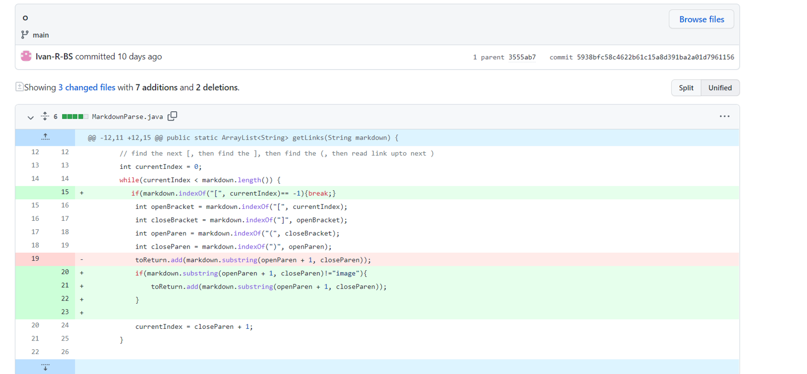

#  Lab Report Two  

##  Code change 1

*click link to see the file that caused this error*

[Error1](https://github.com/Ivan-R-BS/markdown-parser/edit/main/test.md)

## Symptom 

*The bug was that the code would keep looking for the parenthesis if the there was empty space in the file. This resulted in the symptom whenever a file with empty space after the link was there.Fixed by adding an if statement at the start of the while loop to check if there are any parenthesis left, so that it does not keep running and cause an error*

##  Code change 2

*click link to see the file that caused this error*

[Error2](https://github.com/Ivan-R-BS/markdown-parser/edit/main/test2.md)

## Symptom 

*The bug was that the code would add a .png file when it was only suppossed to be collecting links This resulted in the symptom whenever a file with a .png image would have it added to the arraylist that was meant for links.Fixed by adding an if that checks whether or not what is in the parenthesis includes .jpg and if it does it will not add it.*

