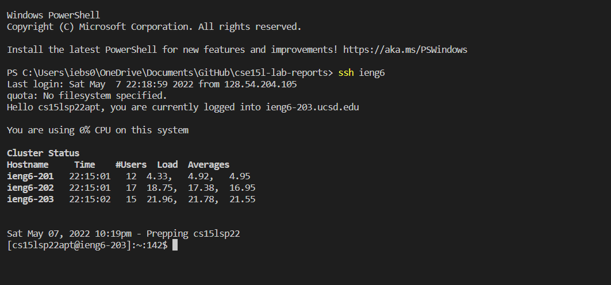
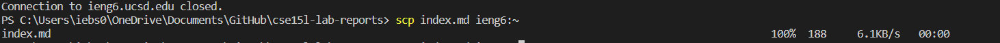
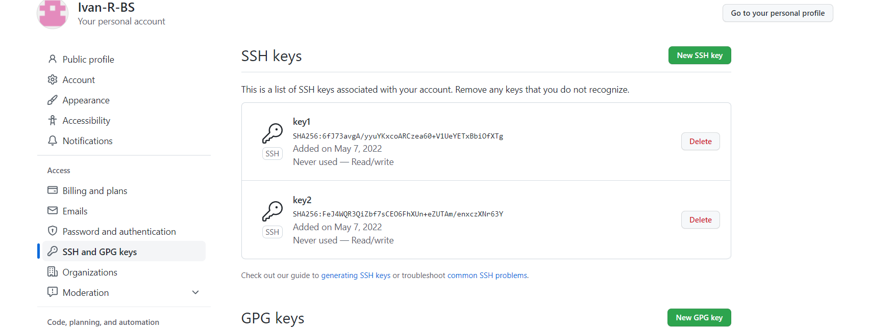
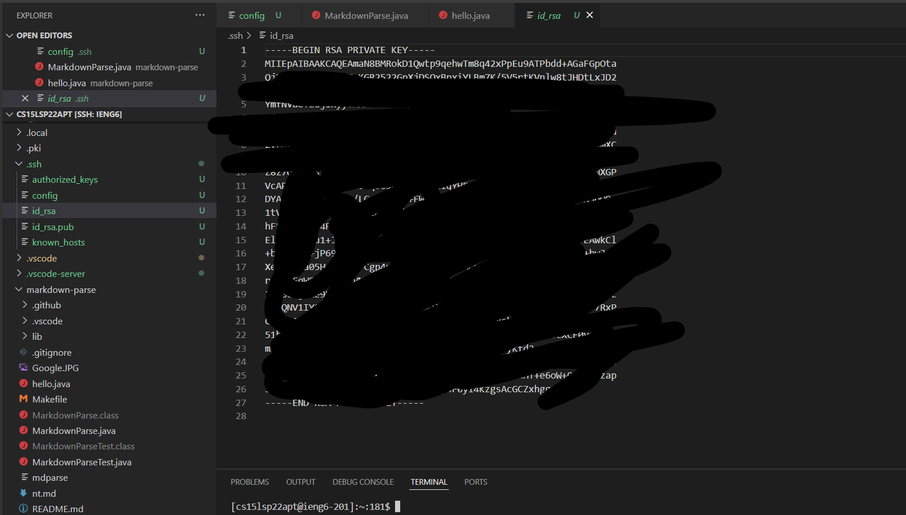
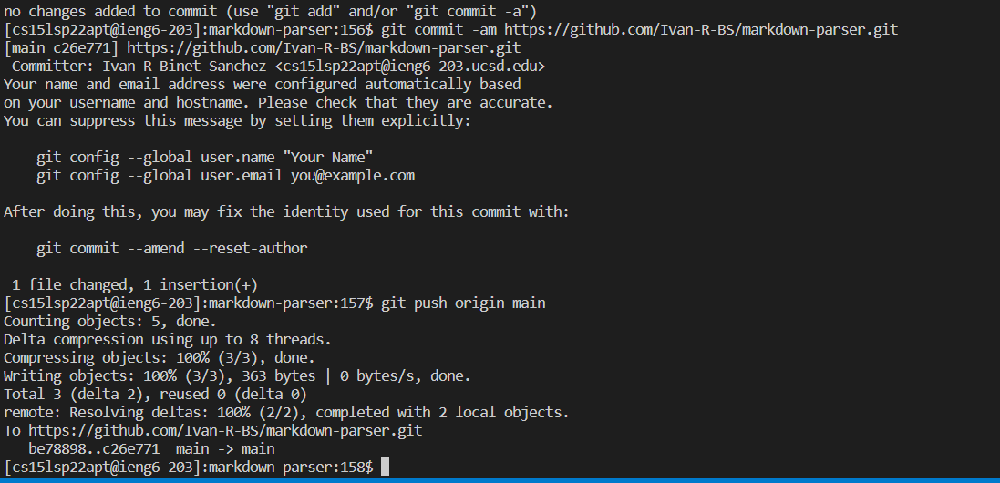
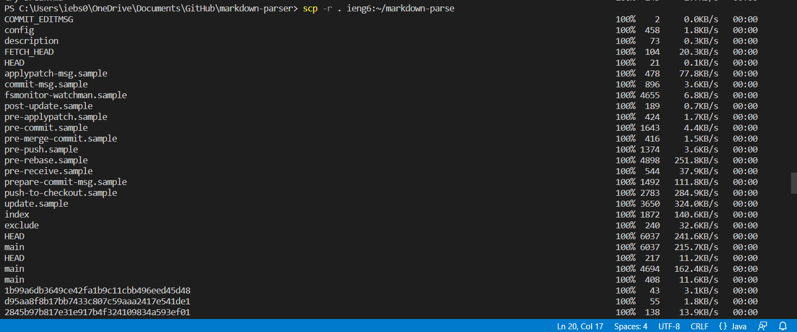
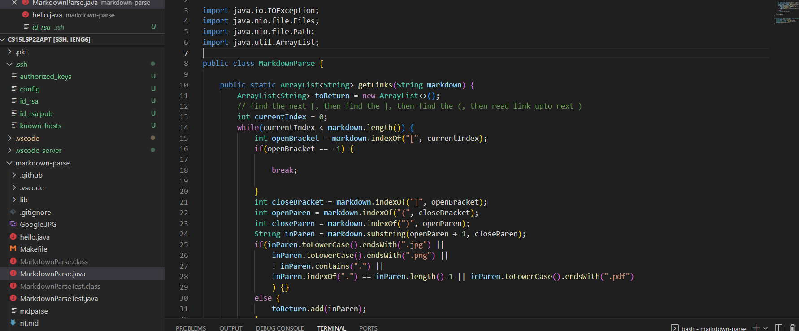
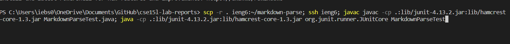

#  Lab Report Three  

##  Streamlining ssh Configuration

**Change config file like so**

**Now if it works correctly you should be able to ssh like so**

**Now if it works correctly you should be able to scp like so**

##  Setting up github access from ieng6

**Save the ssh-key onto github.com like so**

**to find private key check like so**

(*should be located in .ssh/id_rsa in you ieng6 account*)

**Now you can commit and push like so**

*click* [Link](https://github.com/Ivan-R-BS/markdown-parser/commit/c26e7713a5aca1a5b279a807d821861a21b1853a) *to see the commit*

##  Copying whole directories with scp -r

**To copy whole directories just access the directory in the terminal then do the following command**

**to run it use the javac and java from lab 4 for linux**

(My ieng6 terminal is glitching and cant run java for some reason which is why there isnt a picture)

**Shortcut to scp and run it all**

