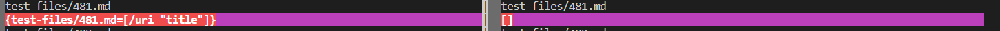
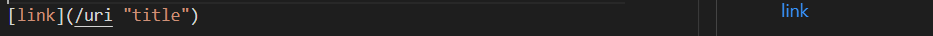
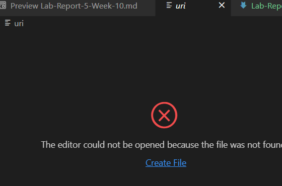
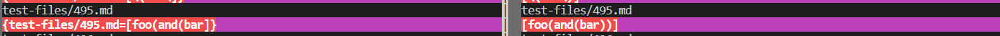
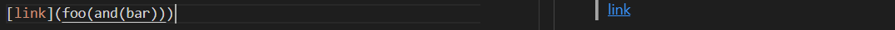
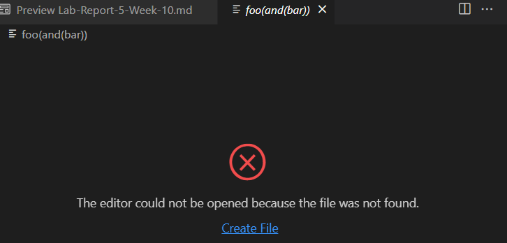
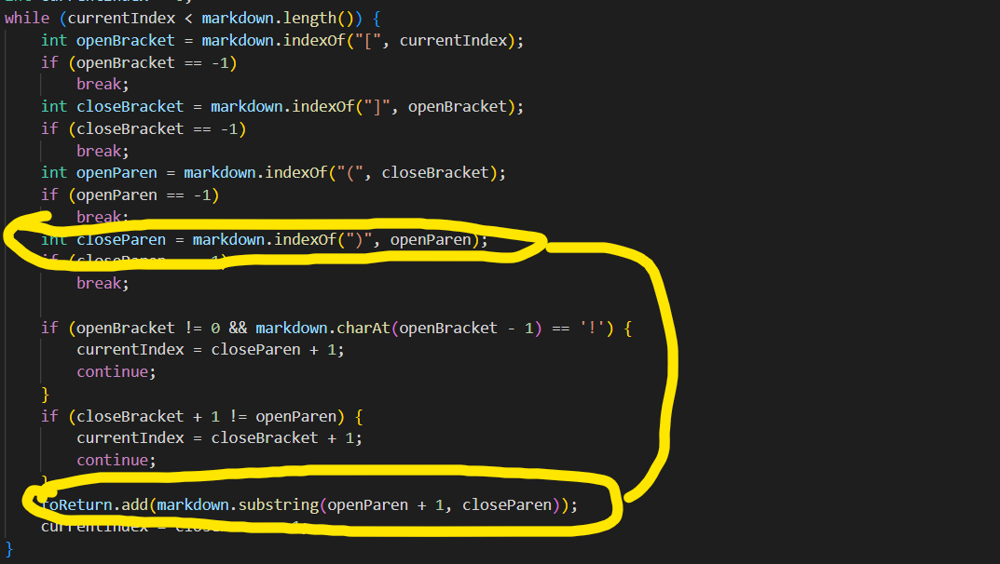

#  Lab Report 5  

**I used Vimdiff in order to find the difference between the parser's output then I looked through it manually to find the where the outputs differed for**
[test file 1](https://github.com/nidhidhamnani/markdown-parser/edit/main/test-files/481.md)**and** [test file 2](https://github.com/nidhidhamnani/markdown-parser/edit/main/test-files/495.md)

## Results for test File 1

**My implementation of the parser produced the wrong output, but so did the other version, so neither passed. My parser produced [/uri "title"], while the other parser produced [ ] however, the correct answer would have been [uri] since inputting the testfiles contents and seeing the preview shows  and clicking the link produces  **

## Results for test File 2

**My implementation of the parser produced the wrong output, while the other parser produced the correct output. My parser produced [foo(and(bar], while the other parser produced [foo(and(bar))]  inputting the testfiles contents and seeing the preview shows  and clicking the link produces  **

## Why my parser failed on the second test file

**The reason my parser got it wrong was because it incorrectly found the first closed parenthesis and took it as the last one, which is where it cut it off. It then used that to create the substring to add to the result, which is why it returned [foo(and(bar] instead of [foo(and(bar))] The error lies within **