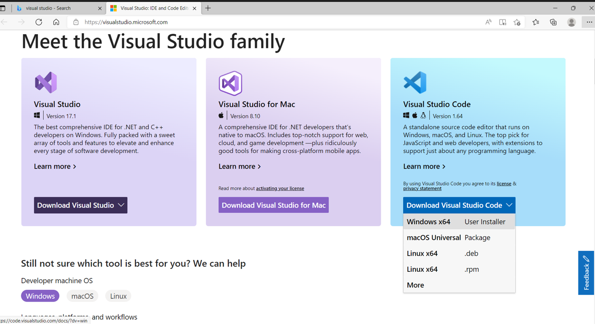
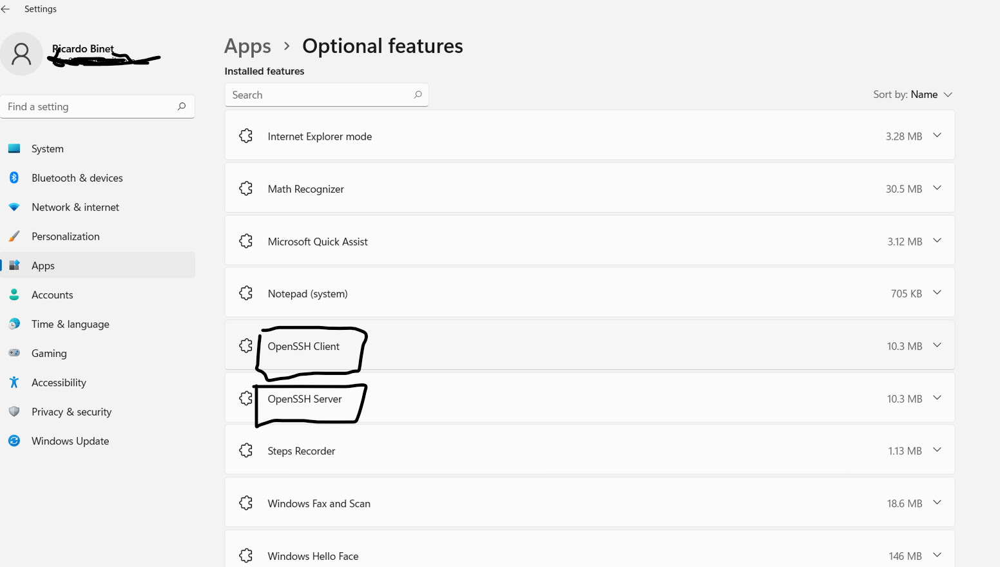
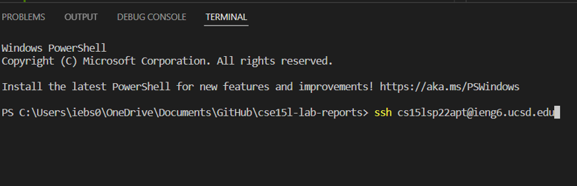
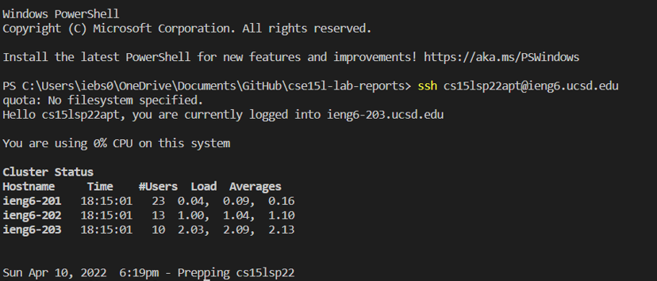
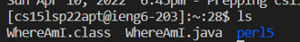
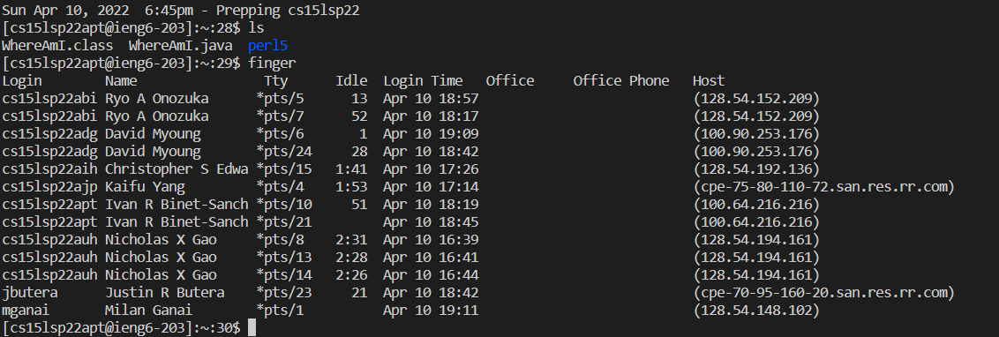
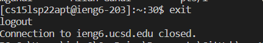
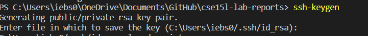
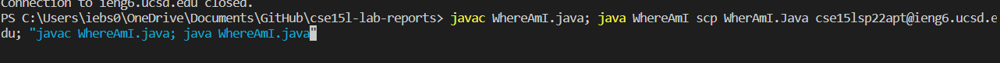

#  Lab Report One  

##  Downloding VSCode

**Step 1: Open Browser of Choice** _(For Example Microsoft Edge)_

**Step 2: Type into the search Bar Visual Studio Code** 

**Step 3: Download whichever version aplies to your pc** _(for example if you have windows you download the 64 bit version)_

 

##  Remotely Connecting 

**Step 1: Open Settings and search up optional features**

**Make sure to download the two boxed in areas**

 

**Step 2: Look up your account and reset your password**

**Step 3: Now that SSH has been downladed and you have your account you can log in using your account name and password** (It should look something like this when connecting.) _note* it will ask for your password after you enter and if it is you first time it will ask yes/no just type y._

**If your terminal looks like this then you have remotely connected succesfully**

##  Trying Some Commands 

**Command 1: ls which lists files**

**Command 2: finger shows people who used the server**

**Command 3: exit to logout**

##  Moving Files with scp

**Step 1: Create or find the file you want to send to the server** _(in this case we will be sending a java file named Whereami)_

**Step 2: In a terminal not logged into the remote server use scp to send the file followed by what account you wish to send it to**

**Step 3: Enter you password when prompted to and it should be complete** _Note if you have set up your ssh key you will not have to enter you password to log in or send files_

## Setting an SSH Key

**Step 1: type ssh-keygen into your terminal that is not logged into the server and press enter to leave the space empty when prompted to enter paraphrase and which file you want to save it in**

**Step 2: log into the ssh and add an ssh to your files with the command mkdir .ssh that is where the password will be stored**

**Step 3: now use scp to send the file where the key that was generated was stored to your account, followed by :~/.ssh/authorized_keys**

## Optimizing Remote Runnig 

**In this example we will be making a change to WhereAmI.java and sending it to the server**

**Step 1: Make changes on file**

**Step 2: use javac on file and java then send and run on server using shortcuts like in the picture to do it all in one go**

